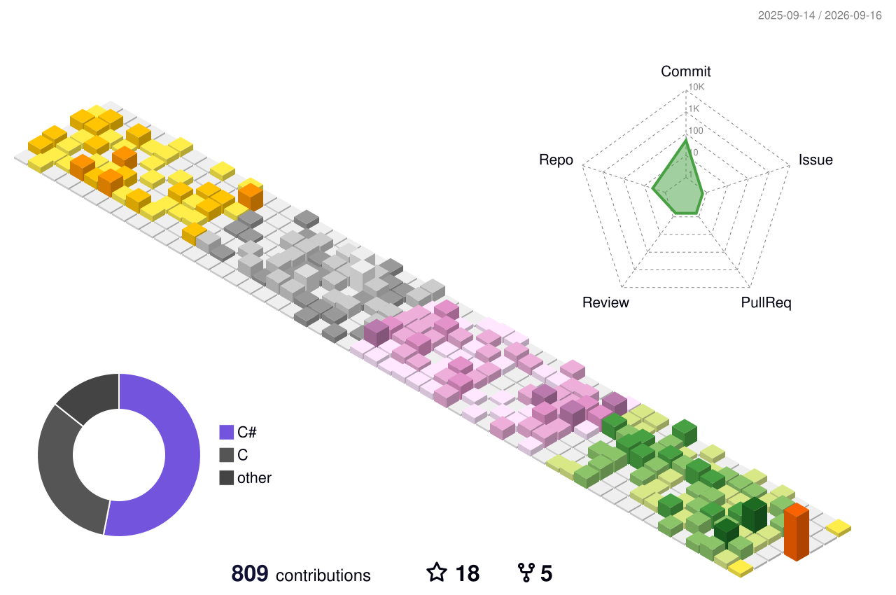

I'm a full-stack developer interested in cross-platform applications, graphics rendering, and practical developer tools.

### About Me

- 💻 Building full-stack and cross-platform applications across desktop, web, and developer tooling
- 🖥️ Focused on consistent development and user experiences across Windows, Linux, and macOS
- 🧩 Interested in Qt, cross-platform technologies, OpenGL, and real-time rendering
- 🌱 Currently learning algorithms and UI design

Thanks for visiting!

---

### Tech Stack

### Tools

---

### 3D Contribution Graph

